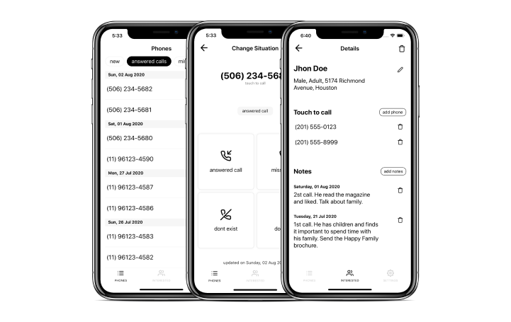
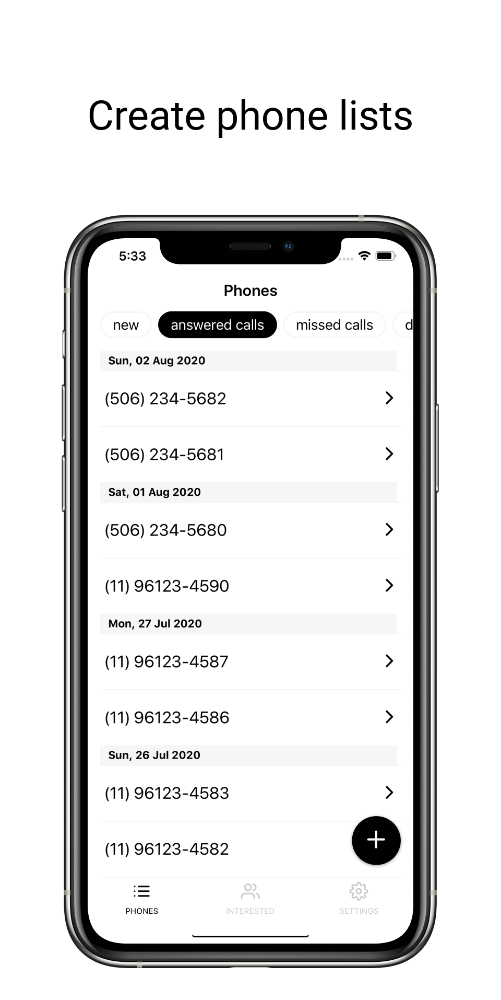
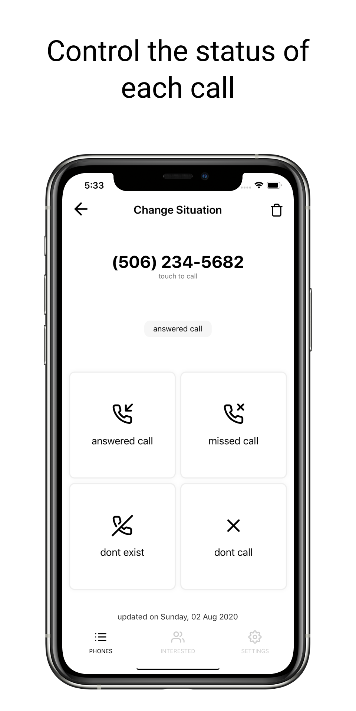
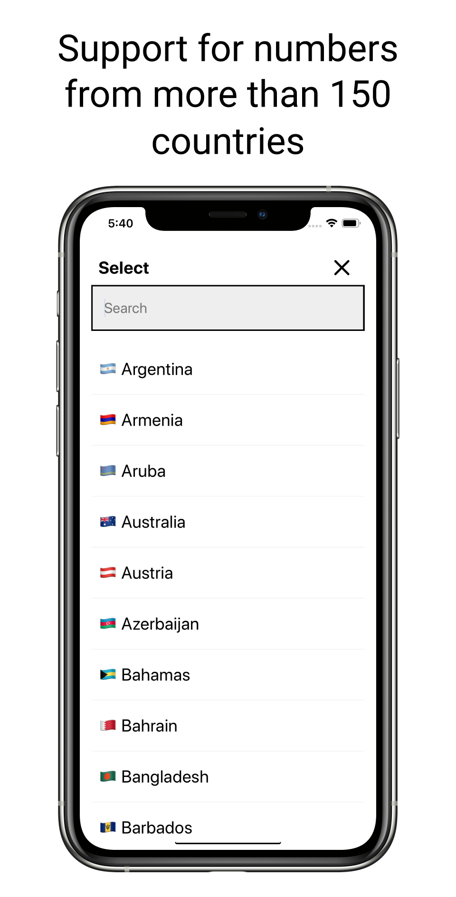

# PhoneBook

  

Generate phone numbers for more than 100 countries. Manage interested people and calls.

## Stack
- React Native
- Realm DB
- Crashlytics
- Firebase
- Typescript

Suport to 🇧🇷 and 🇺🇸.

> OBS: This app was removed from Apple Store and Google Play Store for private reasons

## Images

    
    
    

